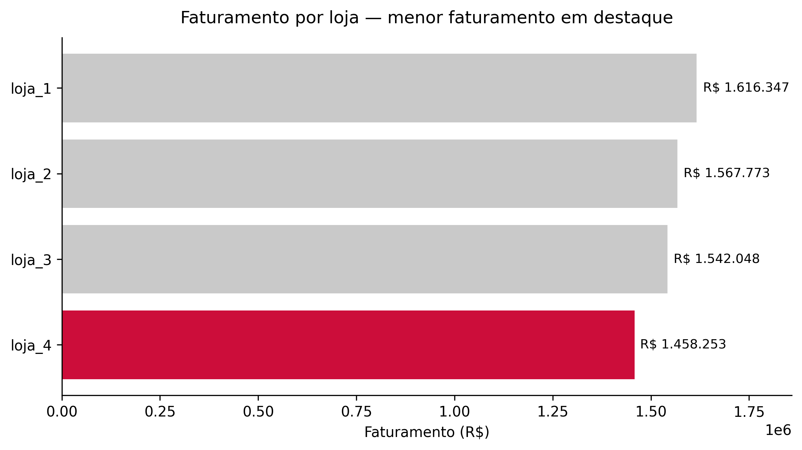
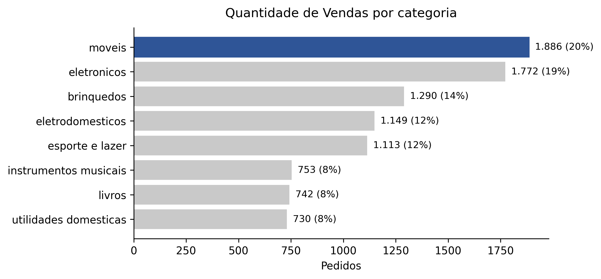
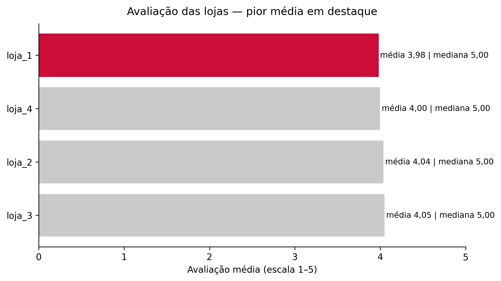
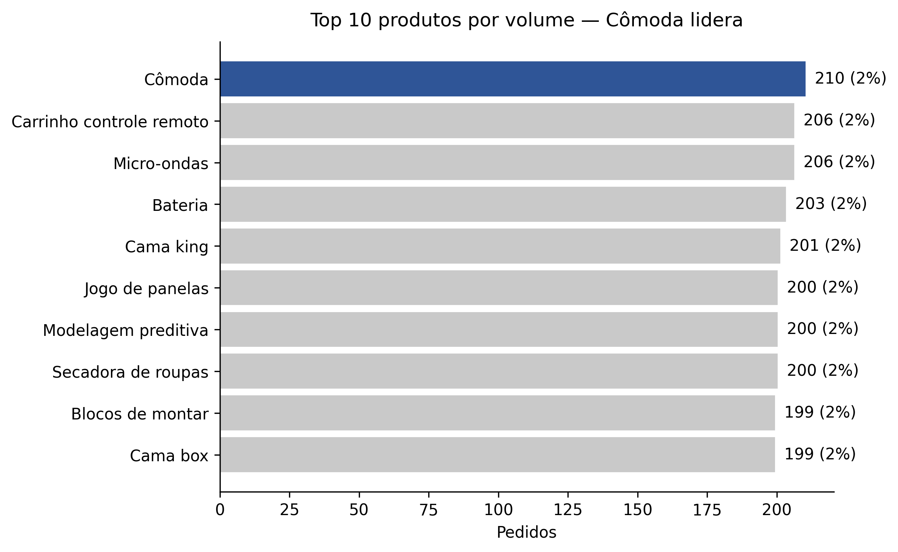
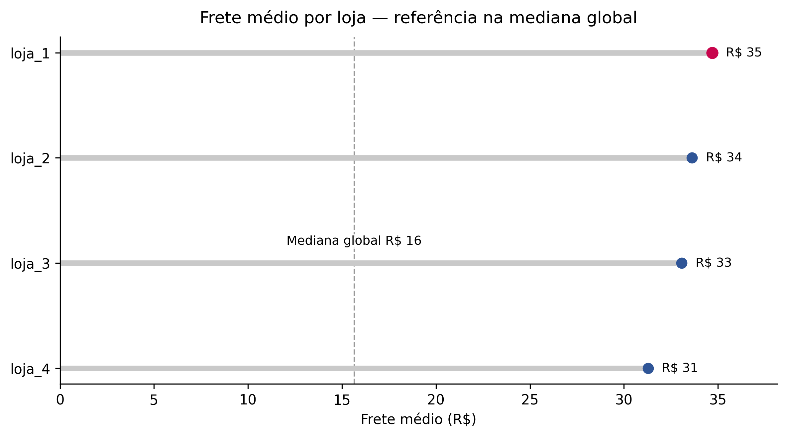

# 🛒 Alura Store — Análise de Desempenho de Lojas
### 🎓 Projeto acadêmico | Challenge Data Science – Alura + Oracle ONE

---

[](https://colab.research.google.com/github/thedrads/alura-store-latam-ds-challenge/blob/main/alura_store_latam_ds_challenge.ipynb)


> Análise comparativa das quatro lojas do e-commerce **Alura Store** para identificar qual loja possui o pior desempenho e deve ser recomendada para venda.

🌐 **[Ver Projeto Online (GitHub Pages)](https://thedrads.github.io/alura-store-latam-ds-challenge/)**

---

## 📑 Sumário

- [Sobre o Projeto](#-sobre-o-projeto)
- [Minha Jornada](#-minha-jornada)
- [Principais Resultados](#-principais-resultados)
- [Visualizações](#-visualizações)
- [Recomendação Final](#-recomendação-final)
- [Estrutura do Repositório](#-estrutura-do-repositório)
- [Tecnologias Utilizadas](#-tecnologias-utilizadas)
- [Como Executar](#-como-executar)
- [Dataset](#-dataset)
- [Metodologia](#-metodologia)
- [Declaração de Uso de IA](#-declaração-de-uso-de-ia)
- [Autor](#-autor)
- [Licença](#-licença)

---

## 🎯 Sobre o Projeto

Este projeto foi desenvolvido como parte do **Challenge Data Science** do programa **Oracle Next Education (ONE)** em parceria com a **Alura**.

### Contexto do Desafio

O **Sr. João** possui uma rede de 4 lojas de e-commerce (Alura Store) e deseja vender uma delas para investir em um novo negócio. Como **analista de dados**, fui contratado para analisar o desempenho das lojas e recomendar qual deve ser vendida.

### Objetivo

Analisar as seguintes métricas para cada loja e identificar a de pior desempenho:

- 💰 Faturamento total
- 📦 Categorias mais vendidas
- ⭐ Avaliação média dos clientes
- 🏆 Produtos mais e menos vendidos
- 🚚 Custo médio do frete

---

## 🚀 Minha Jornada

Sou gestor financeiro com 20 anos de experiência em gestão empresarial, atualmente em transição de carreira para Data Science e Cloud Computing. Este projeto faz parte da minha formação no programa **Oracle Next Education (ONE)** e do **MBA em IA & Análise de Dados (SENAC)**.

Neste desafio, apliquei análise exploratória de dados para resolver um problema real de negócio: identificar qual loja de uma rede deveria ser vendida. Minha experiência em gestão me permitiu ir além dos números, contextualizando a recomendação com visão estratégica.

Como iniciante em programação, busco aprender continuamente e trocar conhecimento com a comunidade. Este repositório representa um passo concreto na construção do meu portfólio técnico — com transparência sobre meu nível atual e compromisso com a evolução constante.

---

## 📊 Principais Resultados

### Faturamento por Loja

| Loja | Faturamento Total | Participação | Ranking |
|------|-------------------|--------------|---------|
| Loja 1 | R$ 1.616.347 | 26,1% | 1º |
| Loja 2 | R$ 1.567.773 | 25,4% | 2º |
| Loja 3 | R$ 1.542.048 | 24,9% | 3º |
| **Loja 4** | **R$ 1.458.253** | **23,6%** | **4º** |

> **Métrica utilizada:** Faturamento Total = Preço + Frete

### Avaliação dos Clientes

| Loja | Média | Mediana |
|------|-------|---------|
| Loja 3 | 4,05 | 5,0 |
| Loja 2 | 4,04 | 5,0 |
| Loja 4 | 4,00 | 5,0 |
| Loja 1 | 3,98 | 5,0 |

A mediana 5,0 em todas as lojas indica alta concentração de avaliações máximas, sem diferencial competitivo claro.

### Categorias Mais Vendidas

| Categoria | Participação |
|-----------|--------------|
| Móveis | 20% |
| Eletrônicos | 19% |
| Brinquedos | 14% |
| Eletrodomésticos | 12% |

Mix pulverizado, sem categoria dominante.

---

## 📈 Visualizações

### 1. Faturamento por Loja


A **Loja 4** apresenta o menor faturamento, com R$ 1.458.253 (23,6% do total).

### 2. Vendas por Categoria


Mercado diversificado, com móveis (20%) e eletrônicos (19%) liderando.

### 3. Avaliação das Lojas


Diferença entre a melhor e pior média é de apenas 0,07 ponto (~1,8%).

### 4. Top 10 Produtos por Volume


Liderança pulverizada: "Cômoda" lidera com apenas 2% do volume.

### 5. Frete Médio por Loja


Frete médio varia de R$ 31 (Loja 4) a R$ 35 (Loja 1). Mediana global: R$ 16.

---

## 🎯 Recomendação Final

### **Recomendo vender a Loja 4.**

| Critério | Análise |
|----------|---------|
| **Faturamento** | Menor contribuição: R$ 1,46M (23,6% do total) |
| **Avaliação** | Média 4,00 — sem vantagem competitiva |
| **Frete** | Menor custo (R$ 31), mas não compensa o gap de receita |
| **Mix de produtos** | Pulverizado, sem alavancas claras para reversão |

> **Análise de sensibilidade:** Mesmo considerando apenas preço (sem frete), a Loja 4 permanece na última posição.

### Perspectiva de Negócio

Com base na minha experiência em gestão financeira, a decisão de vender a Loja 4 considera não apenas o menor faturamento, mas o **custo de oportunidade**: manter uma operação de baixo desempenho consome recursos (gestão, marketing, logística) que poderiam ser direcionados às lojas mais rentáveis.

A diferença de R$ 158 mil entre a Loja 4 e a Loja 1 representa capital que, reinvestido nas operações de melhor performance, pode gerar retorno composto superior à tentativa de recuperação da loja deficitária.

---

## 📁 Estrutura do Repositório

```
alura-store-latam-ds-challenge/
├── README.md                              # Documentação do projeto
├── LICENSE                                # Licença MIT
├── requirements.txt                       # Dependências Python
├── alura_store_latam_ds_challenge.ipynb   # Notebook principal
└── images/                                # Visualizações exportadas
    ├── 01_faturamento_por_loja.png
    ├── 02_vendas_por_categoria.png
    ├── 03_avaliacao_lojas.png
    ├── 04_top10_produtos_volume.png
    └── 05_frete_medio_por_loja.png
```

---

## 🧰 Tecnologias Utilizadas

| Tecnologia | Versão | Uso |
|------------|--------|-----|
| Python | 3.10+ | Linguagem principal |
| Pandas | 2.0+ | Manipulação e análise de dados |
| Matplotlib | 3.5+ | Visualização de dados |
| Google Colab | - | Ambiente de desenvolvimento |
| unicodedata | stdlib | Normalização de texto |

---

## 🚀 Como Executar

### Opção Rápida: Google Colab

[](https://colab.research.google.com/github/thedrads/alura-store-latam-ds-challenge/blob/main/alura_store_latam_ds_challenge.ipynb)

### Execução Local

#### Pré-requisitos

- Python 3.10 ou superior
- pip (gerenciador de pacotes)

#### Instalação

1. **Clone o repositório**
   ```bash
   git clone https://github.com/thedrads/alura-store-latam-ds-challenge.git
   cd alura-store-latam-ds-challenge
   ```

2. **Crie um ambiente virtual** (recomendado)
   ```bash
   python -m venv venv
   source venv/bin/activate  # Linux/Mac
   venv\Scripts\activate     # Windows
   ```

3. **Instale as dependências**
   ```bash
   pip install -r requirements.txt
   ```

4. **Execute o notebook**
   ```bash
   jupyter notebook alura_store_latam_ds_challenge.ipynb
   ```

---

## 📦 Dataset

Os dados são carregados diretamente das URLs oficiais do desafio (repositório Alura):

| Loja | Registros | URL |
|------|-----------|-----|
| Loja 1 | 2.359 | [CSV](https://raw.githubusercontent.com/alura-es-cursos/challenge1-data-science/main/base-de-dados-challenge-1/loja_1.csv) |
| Loja 2 | 2.359 | [CSV](https://raw.githubusercontent.com/alura-es-cursos/challenge1-data-science/main/base-de-dados-challenge-1/loja_2.csv) |
| Loja 3 | 2.359 | [CSV](https://raw.githubusercontent.com/alura-es-cursos/challenge1-data-science/main/base-de-dados-challenge-1/loja_3.csv) |
| Loja 4 | 2.358 | [CSV](https://raw.githubusercontent.com/alura-es-cursos/challenge1-data-science/main/base-de-dados-challenge-1/loja_4.csv) |

**Total:** 9.435 registros | 12 variáveis originais

### Dicionário de Dados

| Coluna | Descrição | Tipo |
|--------|-----------|------|
| `Produto` | Nome do produto | string |
| `Categoria do Produto` | Categoria (móveis, eletrônicos, etc.) | string |
| `Preço` | Preço do produto (R$) | float |
| `Frete` | Valor do frete (R$) | float |
| `Data da Compra` | Data da transação | date |
| `Vendedor` | Nome do vendedor | string |
| `Local da compra` | UF do comprador | string |
| `Avaliação da compra` | Nota de 1 a 5 | int |
| `Tipo de pagamento` | Forma de pagamento | string |
| `Quantidade de parcelas` | Número de parcelas | int |
| `lat` | Latitude | float |
| `lon` | Longitude | float |

---

## 🔬 Metodologia

O projeto segue o processo **ETL + EDA**:

### Processo de Análise

```
┌─────────────────────┐    ┌─────────────────────┐    ┌─────────────────────┐
│     EXTRAÇÃO        │ →  │   TRANSFORMAÇÃO     │ →  │      ANÁLISE        │
│     (4 CSVs)        │    │     (Limpeza)       │    │       (EDA)         │
└─────────────────────┘    └─────────────────────┘    └─────────────────────┘
         ↓                          ↓                          ↓
   • URLs oficiais           • Normalização             • Faturamento
   • pd.read_csv()           • Tipos corretos           • Categorias
                             • Colunas padrão           • Avaliações
                             • total_pago               • Produtos
                                                        • Frete
```

### Etapas Realizadas

1. **Extração:** Carregamento dos 4 CSVs via URLs do repositório oficial
2. **Padronização:** Normalização de nomes de colunas (acentos, snake_case)
3. **Transformação:** Conversão de tipos (datas, numéricos)
4. **Cálculo:** Métrica `total_pago = preço + frete`
5. **Análise:** EDA com foco nas 5 métricas do desafio
6. **Visualização:** 5 gráficos com Matplotlib
7. **Recomendação:** Relatório final com indicação de venda

---

## 🤖 Declaração de Uso de IA

Este projeto foi desenvolvido com assistência de **Inteligência Artificial Generativa**.

### Escopo de Utilização

| Aspecto | Descrição |
|---------|-----------|
| **Ferramenta** | ChatGPT / Claude |
| **Uso** | Revisão de código, boas práticas, documentação |
| **Responsabilidade** | Toda análise e interpretação são do autor |
| **Validação** | Código compreendido e testado antes do uso |

### O que foi feito com IA:
- ✅ Revisão e melhoria de código (PEP 8)
- ✅ Sugestões de documentação (docstrings)
- ✅ Estruturação do README
- ✅ Boas práticas de visualização

### O que foi feito pelo autor:
- ✅ Análise e interpretação dos dados
- ✅ Decisões sobre métricas e metodologia
- ✅ Criação da recomendação final
- ✅ Validação de todos os resultados

### Referências sobre Disclosure de IA

- [Princeton University - Disclosing the Use of AI](https://libguides.princeton.edu/generativeAI/disclosure)
- [Arizona State University - Acknowledging AI Usage](https://libguides.asu.edu/generativeai/acknowledgement)
- [AID Framework - AI Disclosure](https://crln.acrl.org/index.php/crlnews/article/view/26548)

> Este projeto está alinhado à minha formação contínua em IA aplicada aos negócios, incluindo cursos como [IA Aplicada aos Negócios – FGV](https://educacao-executiva.fgv.br/cursos/live/curta-media-duracao-live/inteligencia-artificial-aplicada-aos-negocios-2) e [Generative AI for Productivity – Cornell](https://ecornell.cornell.edu/certificates/technology/generative-ai-for-productivity/).

---

## 👤 Autor

<table>
  <tr>
    <td align="center">
      <a href="https://github.com/thedrads">
        <br>
        <sub><b>Fábio Andrade</b></sub>
      </a>
    </td>
  </tr>
</table>

[](https://www.linkedin.com/in/fabioandradegf/)
[](https://github.com/thedrads)

**Programa:** Oracle Next Education (ONE) + Alura  
**Trilha:** Data Science

---

## 📄 Licença

Este projeto está sob a licença MIT — consulte [LICENSE](LICENSE) para detalhes.

---

<p align="center">
  Desenvolvido por <a href="https://github.com/thedrads">Fábio Andrade</a> | Aberto a feedbacks e contribuições
</p>
