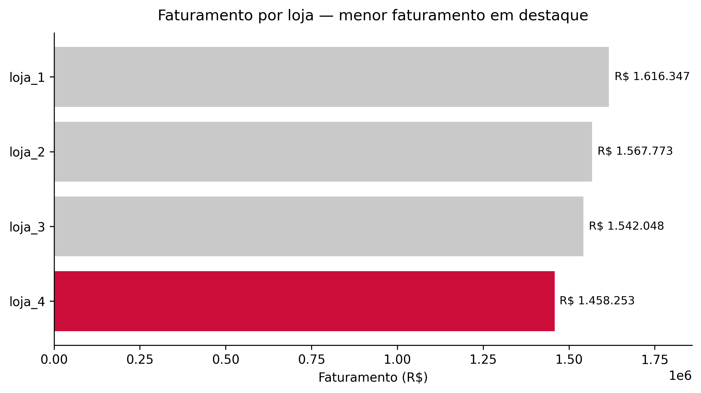
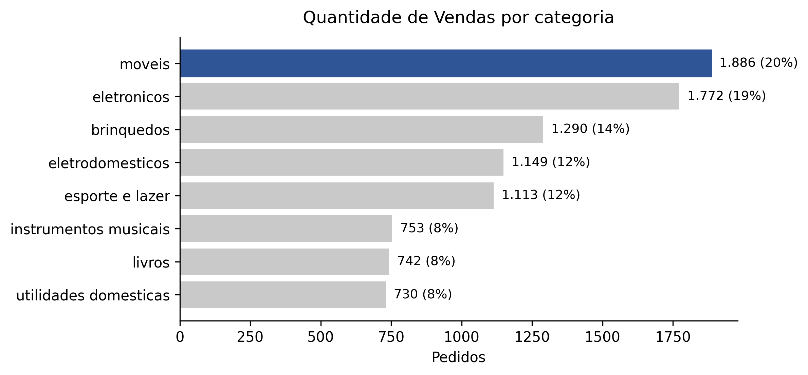
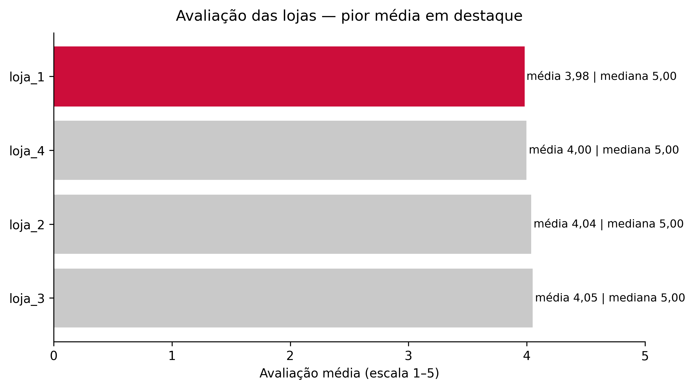
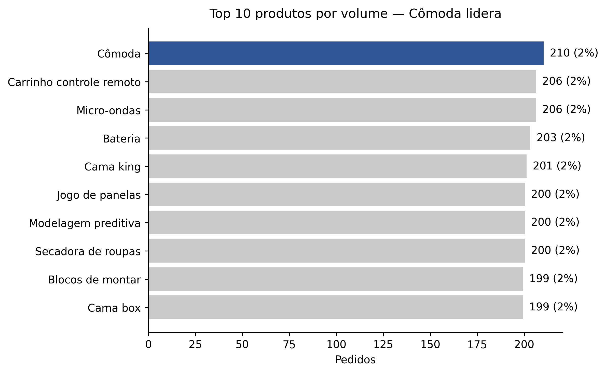
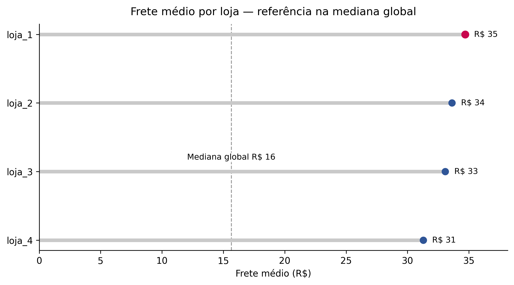

# Alura Store — Desafio de Data Science

Projeto final do ONE: análise das 4 lojas para identificar a de pior desempenho e recomendar qual vender. Feito em **Pandas** e **Matplotlib** no Google Colab.

## Gráficos principais

**Faturamento por loja**  

**Vendas por categoria**  

**Avaliação das lojas**  

**Top 10 produtos por volume**  

**Frete médio por loja**  

## Resumo executivo
Recomendação: **vender a loja_4**, pois apresenta a menor contribuição ao faturamento total no período. As avaliações médias são próximas entre as lojas. O frete médio ligeiramente menor na loja_4 não compensa a menor receita.

## Reprodutibilidade
Abra o notebook no Colab pelo botão acima. Execute o setup e as seções 1 a 5. As figuras são geradas e salvas automaticamente em `images/`.

## Nota sobre a documentação
Este projeto mantém a documentação em dois locais complementares.

**README.md**  
Visão geral do projeto, estrutura de pastas, exemplos de gráficos e instruções de execução.

**Dentro do notebook**  
Seção “Resumo executivo — Alura Store (Desafio ONE)”, com os achados e a recomendação final, pensada para leitura no Colab após executar as células.

**Como evitar divergências**  
Os valores “oficiais” estão no notebook e nas imagens em `images/`. Sempre que atualizar as análises, reexecute as células de gráficos para atualizar `images/` antes do commit.
